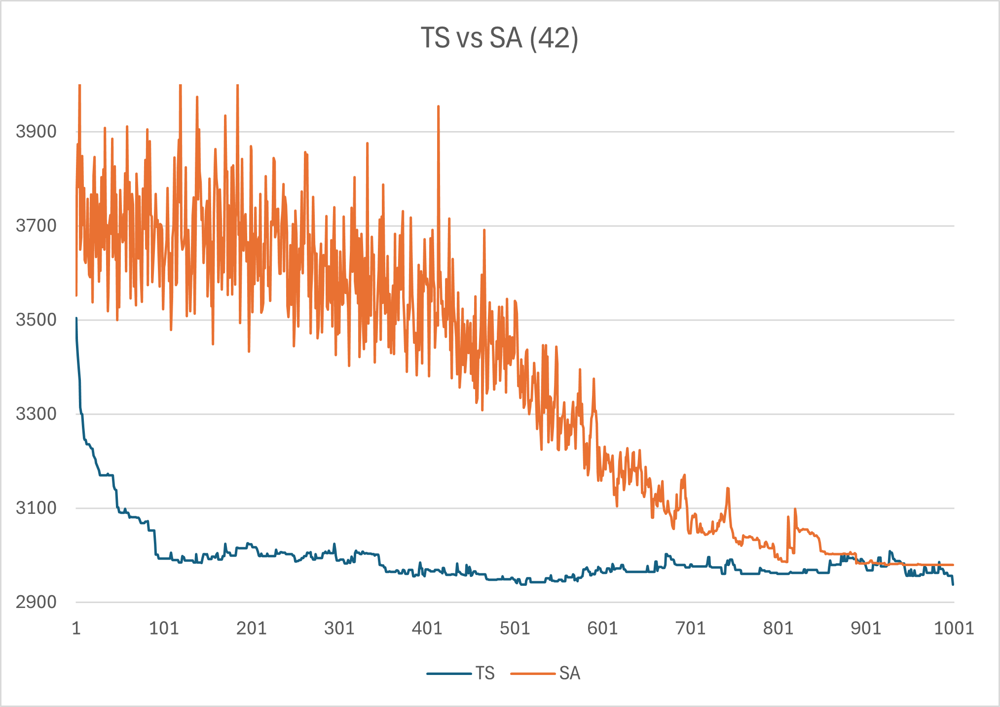
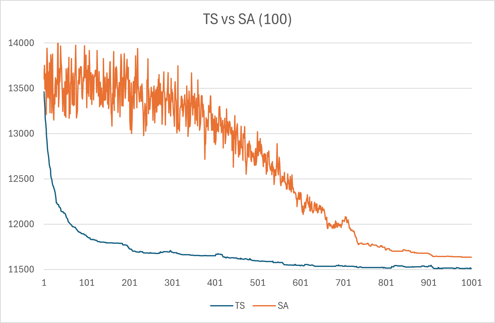

# Optimization Algorithms - Project Overview

## Overview
This repository contains implementations of optimization algorithms designed for scheduling problems. Each folder addresses a specific problem, algorithm, or visualization tool, with detailed descriptions provided below.

---

## Folder Structure and Details

### **Folder: 1**
#### Algorithm: Carlier Algorithm
- **Problem**: Single-machine scheduling to minimize the makespan (Cmax).
- **Data**: Tasks include start times, durations, and deadlines.
- **Description**:
  - The Carlier Algorithm extends the Schrage method by introducing task interruptions and lower bounds (LB).
  - The implementation emphasizes heuristic approaches for searching optimal task sequences.
- **Why Used**: Combines efficiency and solution quality for single-machine scheduling problems.

#### Files:
- `data.txt`: Input task data.
- `program.cpp`: Implementation of the Carlier algorithm.

---

### **Folder: 2**
#### Algorithm: Dynamic Programming
- **Problem**: Single-machine scheduling to minimize weighted tardiness.
- **Data**: Tasks are described by duration, weight, and deadlines.
- **Description**:
  - Uses dynamic programming to divide the problem into smaller subproblems.
  - Optimizes task ordering to achieve minimal penalties.
- **Why Used**: Ensures exact solutions with systematic computational efficiency.

#### Files:
- `witi.data.txt`: Input dataset for weighted tardiness scheduling.
- `program.cpp`: Implementation using dynamic programming.

---

### **Folder: 3**
#### Algorithms: NEH and QNEH
- **Problem**: Multi-machine flow shop scheduling to minimize the makespan (Cmax).
- **Data**: Processing times for tasks on multiple machines.
- **Description**:
  - **NEH Algorithm**:
    - Iteratively inserts tasks into the schedule to find optimal sequences.
    - Complexity: O(n³ · m).
  - **QNEH Algorithm**:
    - An optimized version of NEH using auxiliary tables for faster task insertion.
    - Complexity: O(n² · m).
- **Why Used**: NEH and QNEH effectively solve flow shop problems, with QNEH being more efficient for large datasets.

#### Files:
- `neh.cpp`: NEH implementation.
- `qneh.cpp`: QNEH implementation.
- `qneh_uk.cpp`: Alternative QNEH implementation.
- `neh.data.txt`: Input dataset.

---

### **Folder: 4**
#### Algorithms: Simulated Annealing and Tabu Search
- **Problem**: Multi-machine scheduling to minimize the makespan (Cmax).
- **Data**: Tasks and their processing times on machines.
- **Description**:
  - **Simulated Annealing**:
    - Inspired by annealing in metallurgy; probabilistically explores solutions to avoid local minima.
    - Parameters include initial temperature and cooling rate.
  - **Tabu Search**:
    - Uses a tabu list to avoid revisiting local minima.
    - Parameter tuning (e.g., `tabu tenure`) is crucial for performance.
- **Why Used**: Metaheuristics efficiently handle large, complex solution spaces.

#### Files:
- `simulated_annealing.cpp`: Simulated Annealing implementation.
- `tabu.cpp`: Tabu Search implementation.
- `neh.data.txt`: Shared input data.
- `results.csv`: Results summary.
- `results_tabu.csv`: Tabu Search results.

---

### **Folder: 5**
#### Visualization Components
- **Purpose**: Provides tools to visualize scheduling results or algorithm performance.
- **Files**:
  - `sats.html`: Web interface for visualization.
  - `sats.css`: Styling for the interface.
  - `sats.js`: JavaScript functionality.

---

## Preview
The graphs below show the process of the Simulated Annealing algorithm in comparison with Tabu Search on 2 diffrent data sets.

  
  

